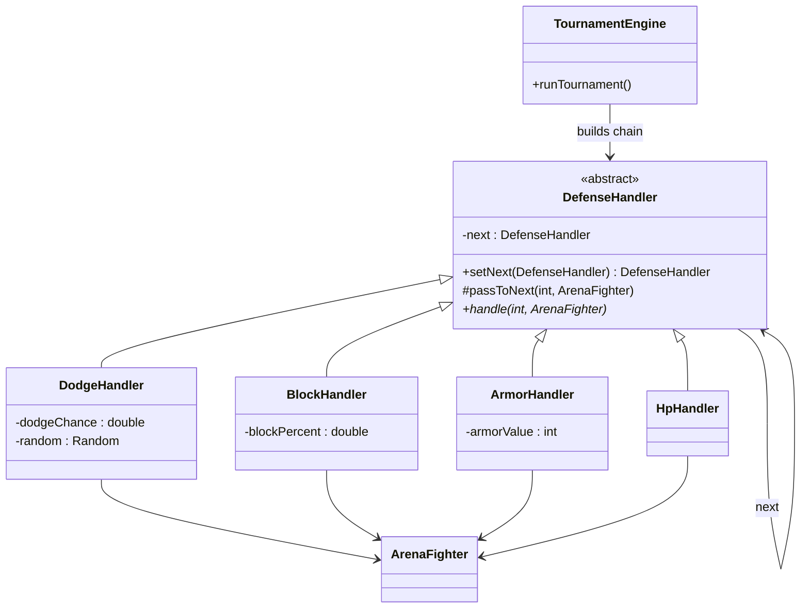

# Chain of Responsibility UML

```mermaid
classDiagram
    class DefenseHandler {
        <<abstract>>
        -next : DefenseHandler
        +setNext(DefenseHandler) DefenseHandler
        #passToNext(int, ArenaFighter)
        +handle(int, ArenaFighter) *
    }

    class DodgeHandler {
        -dodgeChance : double
        -random : Random
    }

    class BlockHandler {
        -blockPercent : double
    }

    class ArmorHandler {
        -armorValue : int
    }

    class HpHandler
    class TournamentEngine {
        +runTournament()
    }
    class ArenaFighter

    DefenseHandler <|-- DodgeHandler
    DefenseHandler <|-- BlockHandler
    DefenseHandler <|-- ArmorHandler
    DefenseHandler <|-- HpHandler
    DefenseHandler --> DefenseHandler : next
    DodgeHandler --> ArenaFighter
    BlockHandler --> ArenaFighter
    ArmorHandler --> ArenaFighter
    HpHandler --> ArenaFighter
    TournamentEngine --> DefenseHandler : builds chain
```
