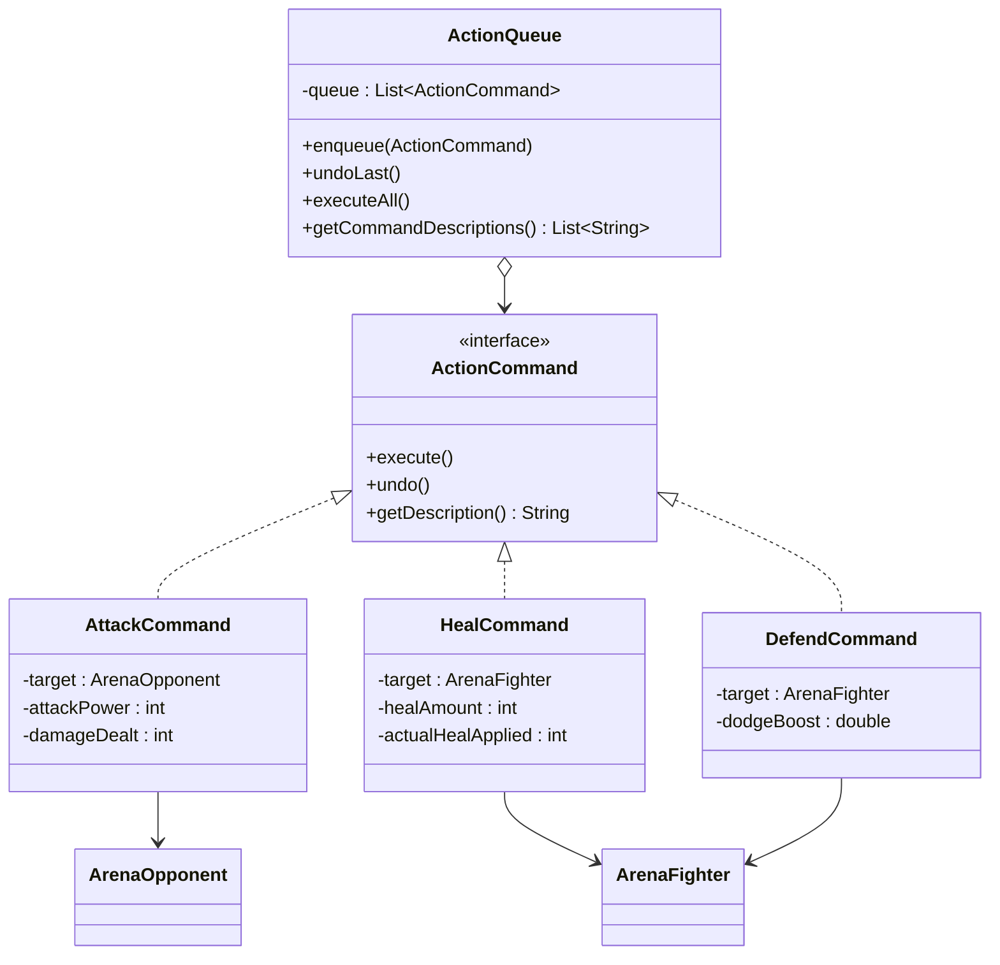

# Command Pattern UML

```mermaid
classDiagram
    class ActionCommand {
        <<interface>>
        +execute()
        +undo()
        +getDescription() String
    }

    class AttackCommand {
        -target : ArenaOpponent
        -attackPower : int
        -damageDealt : int
    }

    class HealCommand {
        -target : ArenaFighter
        -healAmount : int
        -actualHealApplied : int
    }

    class DefendCommand {
        -target : ArenaFighter
        -dodgeBoost : double
    }

    class ActionQueue {
        -queue : List~ActionCommand~
        +enqueue(ActionCommand)
        +undoLast()
        +executeAll()
        +getCommandDescriptions() List~String~
    }

    class ArenaFighter
    class ArenaOpponent

    ActionCommand <|.. AttackCommand
    ActionCommand <|.. HealCommand
    ActionCommand <|.. DefendCommand
    ActionQueue o--> ActionCommand
    AttackCommand --> ArenaOpponent
    HealCommand --> ArenaFighter
    DefendCommand --> ArenaFighter
```
